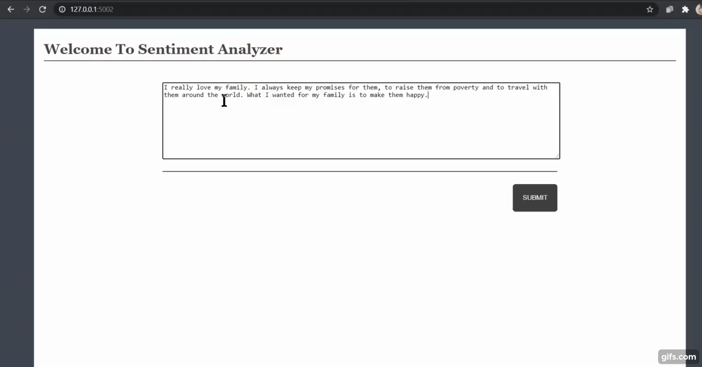

# Sentiment Analysis

Sentiment analysis, a key component of Natural Language Processing (NLP), focuses on automatically discerning the emotional tone and subjective information within text. Its applications are vast and versatile, ranging from gauging public sentiment in product reviews, movie critiques, and social media content, to assessing public opinion in political polls and surveys. Sentiment analysis helps businesses make data-driven decisions, as they can adjust products and services based on customer feedback or react swiftly to shifts in public perception. It's a fundamental tool in market research, customer service, and social media monitoring, providing insights into how people feel about a wide array of topics and products, making it an indispensable resource for organizations in today's data-driven world.

## VADER Sentiment
VADER Sentiment, short for "Valence Aware Dictionary and Sentiment Reasoner," is a specialized lexicon and rule-based sentiment analysis tool. It excels in analyzing sentiments expressed in social media content and is adaptable to various text domains.

This tool is especially effective in gauging sentiment in texts, making it a valuable component of the project.
 
 
### Exploring Sentiment Analysis

Sentiment analysis, a crucial domain within Natural Language Processing, involves automatically identifying the emotional tone of text. Its applications are vast, from assessing customer feedback in online shopping platforms like Amazon to evaluating movie reviews and social media content. Sentiment analysis can be as straightforward as categorizing text as positive or negative, or it can delve deeper into analyzing nuanced sentiment states.

Sentiment analysis is all about scrutinizing opinions and emotions conveyed through text or images, spanning a wide range of topics. It plays a vital role in guiding business decisions. For instance, if public sentiment towards a product is unfavorable, a company might choose to adjust the product or discontinue it to prevent financial losses.

Sources of public sentiment are diverse, including public interviews, opinion polls, surveys, and more. With the growing presence of people on social media platforms like Facebook and Twitter, these channels have become valuable sources for mining public sentiment.

The resulting output takes various forms in the field of sentiment analysis.
The output looks like :  

